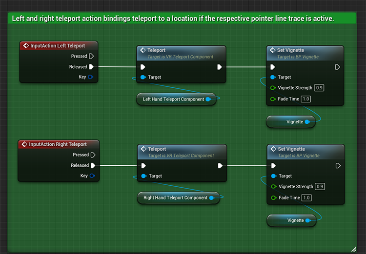
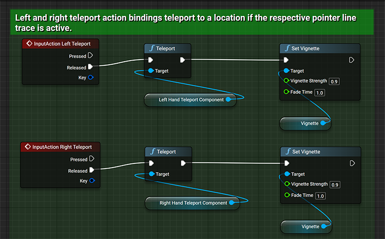

## 1. Technical Implementation for the tutorial ✔️

The first step is to create the technical implementation for the tutorial. Create a new branch in the [VR tutorial repository](https://github.com/CesiumGS/cesium-unreal-vr-tutorial) with your code additions. When your changes are complete, open a new pull request for the feature and please fill out all of the required fields.

Be sure to comment the blueprints you create. Follow these comment best practices:
- Use the comment descriptions to give the readers a specific technical explanation for the highlighted portion of logic. You can also use comments to point out any potentially interesting or obscure settings or approaches. 
- Use comment colors as specified below. These colors add variation on the tutorial learning page and to allow readers to quickly differentiate between where logical flow moves to and from. 

Comment colors (all in Hex sRGB). Use font size 14.  
`#27D541FF` Comments on the pawn  
`#D5B227FF` Comments on an actor component  
`#2779D5FF` Comments on a non pawn actor  

These colors have been tested on blueprintue.com. While they appear vibrant in the unreal editor, they appear more neutral on the website (pictured below).

Blueprint in Unreal            |  Blueprint on blueprintue.com
:-------------------------:|:-------------------------:
  |  

## 2. Adding blueprints to blueprintue.com 📘

To create a new blueprintue:
1. Log into blueprintue.com.
1. The landing page of the site brings you to create a new blueprint. You can click on the logo to return to this page.
1. Set the name as something descriptive with the object name first, followed by the name of the function or event graph.
1. Set the exposure of the blueprint to “Unlisted”. This will prevent the blueprint from showing up on the main blueprintue site. The link will still be viewable to readers once it is embedded on the tutorial page.
1. Click the “Create your blueprint” button on the bottom.

- You can view all owned blueprints by clicking on “Profile” in the upper right corner.
- A blueprint can be edited by clicking on it and selecting the “Edit blueprint” button next to its title. To make adjustments add in a new version, and you have the option to remove previous versions in light of mistakes or typos. 

## 3. Drafting up tutorial text in Google Docs

1. Create a new folder in the ["Learning Content"](https://drive.google.com/drive/folders/1HjB710sAdvjJT4GxldsMP20LL6mZtres?usp=sharing) folder to house the draft text and images associated with the tutorial.   Convention for VR Tutorials is "CVR #X FeatureName".
1. Create a new Google doc in this folder from the VR Tutorial text template. Add any associated images to the folder.
1. Once the draft is complete, open a new issue in this repository to track the release and review of this tutorial. Use the VR Tutorial issue template.

[VR Tutorial text template](https://docs.google.com/document/d/18wJF1SXb1XiV7wKQqYGPxjXW9JNhEjhprQHJJ03wOK0/edit?usp=sharing) 
[Teleportation Draft (example)](https://docs.google.com/document/d/1xzQJ0zzISj7TVAEeOcnZgyj0rJWwACdCtpbE9m_5Ibk/edit)

### Tips:
1. Use info boxes when possible to draw attention to the reader if they might see something they are not familiar with.
1. When mentioning a feature in Unreal that is not fully covered in this tutorial, add in a link to any official Unreal documentation that would be helpful to readers seeking more information.
1. Add in links to blueprintue with the caption format already laid out like so:    FeatureFolder > Blueprints > <b>BP_FeatureComponent</b> > <i>DoSomething</i> function   This makes it easier to review and add into Prismic later.
